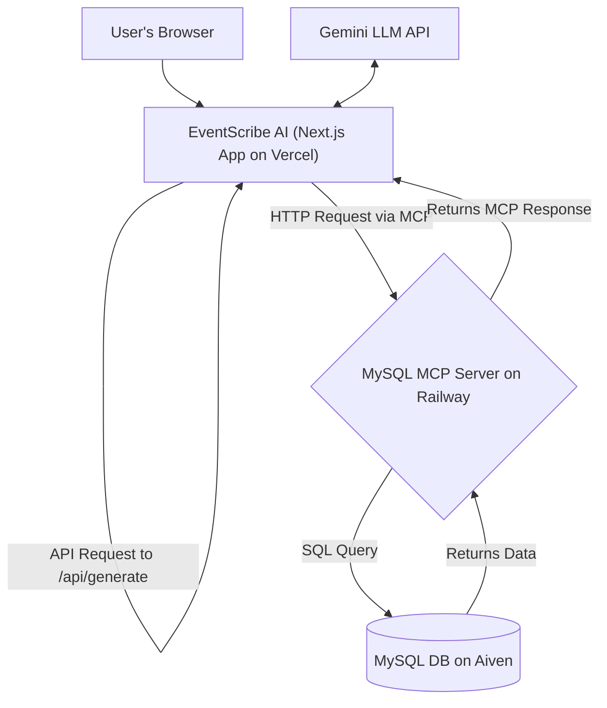

# EventScribe AI 🎯

  [](https://nextjs.org)  
  [](https://www.typescriptlang.org/)  
  [](https://modelcontextprotocol.io/)  
  [](https://ai.google.dev/)

  **EventScribe AI** is a full-stack, decoupled web application featuring an **autonomous AI agent** that dynamically queries database to generate rich, context-aware event descriptions. It uses the **Model Context Protocol (MCP)** to securely bridglive data with large language models
This project demonstrates a professional, production-ready architecture where the frontend (Vercel), backend server (Railway)and database (Aiven) are all independently deployed and scalable services
**Companion Repository:** [MySQL-MCP-Server](https://github.com/AbeqqalMarouane/MySQL-MCP-Server
## ✨ Feature
### 🤖 Autonomous AI Agent
- **Dynamic SQL Generation:** The AI agent analyzes user prompts and the database schema to write its own SQL queries on thfly.
- **Schema-Aware Context:** The agent first fetches the database schema via a secure MCP resource, allowing it to understantable structures and relationships before acting.
- **Secure Data Access:** The Next.js application has **zero direct database credentials**. All database interactions arfunneled through the secure, read-only MCP server.
- **Smart Prompt Enhancement:** The final prompt sent to the LLM is automatically enriched with the precise data the agenchose to fetch
### 📚 History Management & UI
- Session persistence with local storage.
- Collapsible sidebar to revisit and regenerate previous outputs.
- Full CRUD interface for managing all database entities.
- Professional, responsive UI built with Tailwind CSS and shadcn/ui
## 🏗️ Production Architectur
This project utilizes a modern, decoupled architecture perfect for scalability and security. The frontend, backend server, andatabase are all separate, independently deployed services that communicate over the internet

## 🚀 Reusing the AI Enhancement Service in Other Project
The core logic of this application is available as a reusable service. You can integrate this AI-powered prompt enhancemeninto any other Next.js project with a few simple steps
### Step 1: Install Dependencies
In your existing project's terminal, install the necessary libraries:
```bash
npm install @google/generative-ai @modelcontextprotocol/sdk
```
### Step 2: Copy the Service File
Copy the `lib/eventGenerator.ts` file from this project into a `lib/` directory in your own project's root
### Step 3: Configure Environment Variables
In your project's `.env.local` file, add the following two variables. The service will automatically use them.
```env
# Your API key for the Google AI model
GEMINI_API_KEY="your_secret_gemini_api_key_here
# The public URL of a deployed MySQL MCP Server
NEXT_PUBLIC_MCP_SERVER_URL="https://your-mysql-mcp-server-production.up.railway.app/mcp"
```
### Step 4: Use the Function in Your Code
Now, in any server-side part of your application (like an API route), you can import and call the `generateEventDescriptionfunction
**Example Usage:**
```typescript
import { generateEventDescription } from '@/lib/eventGenerator'
async function yourFunction() {
  const simplePrompt = "Tell me about the DevOps conference";
  
  try {
    const result = await generateEventDescription(simplePrompt);
    console.log("Enhanced Description:", result.description);
    console.log("Fetched Context:", result.context);
  } catch (error) {
    console.error("Enhancement failed:", error);
  }
}
```
## 📖 Deployment Guide for This Projec
To deploy your own instance of EventScribe AI, you will need to set up the three separate services
### Part 1: Database (Aiven)
1.  Create a **free MySQL database** on a cloud provider like [Aiven](https://aiven.io/).
2.  Get your **Service URI**. This contains your database credentials.
3.  Run the seed script from this project locally (see "Local Development" below) to set up the tables and data in your necloud database
### Part 2: Backend - The MCP Server (Railway)
1.  Clone the [MySQL-MCP-Server](https://github.com/AbeqqalMarouane/MySQL-MCP-Server) repository.
2.  Deploy it as a **Web Service** on **Railway**.
3.  In the Railway project's **Variables** tab, set the `DB_HOST`, `DB_USER`, `DB_PASSWORD`, etc., using the credentials froyour Aiven database.
4.  Railway will provide a public URL. This is your live MCP server endpoint
### Part 3: Frontend - The Next.js App (Vercel)
1.  Fork and clone this repository.
2.  Import the project into **Vercel**.
3.  In the Vercel project's **Environment Variables** settings, add:
    - `GEMINI_API_KEY`: Your key from Google AI Studio.
    - `NEXT_PUBLIC_MCP_SERVER_URL`: The full public URL of your deployed Railway server from Part 2, including the `/mcp` path.
4.  Deploy
## 💻 Local Developmen
To run this application on your local machine for development
1.  **Clone this repository** and install dependencies (`npm install`).
2.  **Set up the `.env.local` file** as described in the "Reusing the AI Service" section, pointing it to your deployed Railwaserver.
3.  **Run the development server:**
    ```bash
    npm run dev
    ```
4.  Open [http://localhost:3000](http://localhost:3000) in your browser
## 🤝 Contributin
Contributions are welcome! Please feel free to fork the repository, make your changes, and submit a pull request
## 📄 Licens
This project is licensed under the MIT License. See the `LICENSE` file for details.
