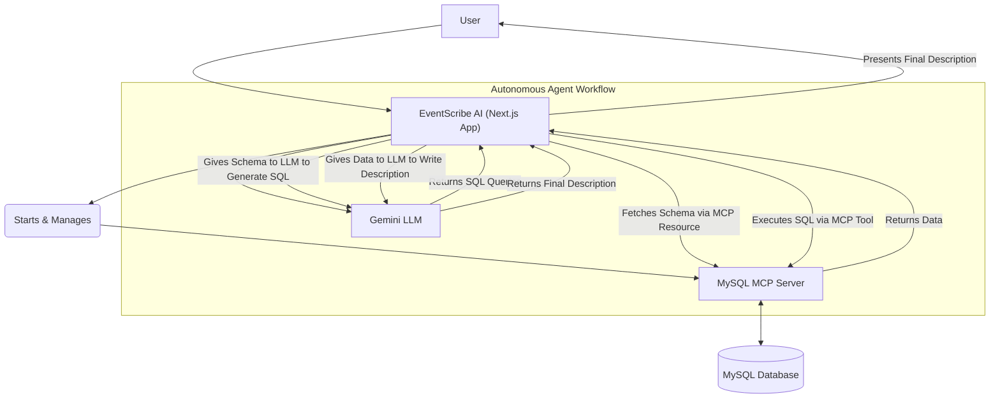

# EventScribe AI 🎯

    
    
    
  

  **EventScribe AI** is a full-stack web app featuring an **autonomous AI agent** that dynamically queries your database to generate intelligent, context-aware event descriptions. It uses the **Model Context Protocol (MCP)** to securely bridge live structured data and powerful LLMs like **Google Gemini**.
  
  For the **MySQL MCP Server** link : https://github.com/AbeqqalMarouane/MySQL-MCP-Server

  ## ✨ Features

  ### 🤖 Autonomous AI Agent
  - **Dynamic SQL Generation** from user prompts.
  - **Schema-Aware Reasoning** using MCP schema resources.
  - **Secure Data Access** via read-only MCP server.
  - **Enhanced Prompting** with contextualized data fetch.

  ### 📚 History Management
  - Session persistence with local storage.
  - Sidebar to revisit and regenerate previous outputs.

  ### 🗄️ Database Management
  - CRUD for Events, Speakers, Sessions, Sponsors.
  - Input validation with **Zod**.
  - Real-time tables for easy management.

  ### 🎨 Modern UI/UX
  - Minimal design inspired by Linear & Notion.
  - Responsive UI built with **Tailwind CSS**.
  - Powered by **shadcn/ui** components.

  ## 🚀 Quick Start

  This project has two parts:
  1. **MCP Server** – bridges database access
  2. **Next.js App** – main frontend + AI agent

  ### ✅ Prerequisites
  - Node.js 18+
  - MySQL 8.0+
  - Google AI API Key ([Get one here](https://ai.google.dev/gemini-api/docs/get-started/get-api-key))
  - Clone the repo: `PromptEnhancing_UsingMCP`

  ### 🛠️ Part 1: MCP Server

      cd MySQL_MCP_Server
      npm install
      cp .env.example .env

  Edit `.env` with your DB credentials:

      DB_HOST=localhost
      DB_USER=root
      DB_PASSWORD=your_mysql_password
      DB_NAME=eventscribe
      DB_PORT=3306

  Build the server:

      npm run build

  ### 💻 Part 2: Next.js App

      cd ../PromptEnhancing_UsingMCP
      npm install
      cp .env.example .env.local

  Edit `.env.local`:

      GEMINI_API_KEY=your_google_ai_api_key
      MCP_SERVER_PROJECT_PATH="C:\\path\\to\\MySQL_MCP_Server"

  ### 🧪 Part 3: Run the App

  1. **Create the database** in MySQL:

      CREATE DATABASE eventscribe;

  2. **Optional: Seed with sample data**

      node scripts/seed-sample-data.js

  3. **Run development server**

      npm run dev

  Then open: [http://localhost:3000](http://localhost:3000)

  ## 🏗️ Architecture Overview

  ### 🔑 Key Concept: Model Context Protocol

  The architecture separates:
  - **Next.js App** – AI logic + orchestration
  - **MCP Server** – secure data access layer

  ### ⚙️ Agentic Workflow Diagram

  ## 🧱 Tech Stack

  | Area               | Tech                             |
  |--------------------|----------------------------------|
  | Framework          | Next.js 14+ (App Router)         |
  | Language           | TypeScript                       |
  | AI Orchestration   | Model Context Protocol (MCP)     |
  | Database           | MySQL (via `mysql2`)             |
  | AI Model           | Google Gemini                    |
  | Styling            | Tailwind CSS                     |
  | UI Components      | shadcn/ui                        |
  | Validation         | Zod                              |

  ## 📁 Project Structure

      .
      ├── MySQL_MCP_Server/           # MCP server
      │   ├── src/index.ts
      │   ├── package.json
      │   └── ...
      └── PromptEnhancing_UsingMCP/   # Next.js frontend
          ├── app/
          │   └── api/generate/route.ts
          ├── components/
          └── ...

  ## 🧯 Troubleshooting

  **❌ MCP Server doesn't start**  
  - Check `MCP_SERVER_PROJECT_PATH` in `.env.local`  
  - Ensure `npm install && npm run build` in `MySQL_MCP_Server`

  **❌ AI fails to generate SQL**  
  - Try again; LLMs aren't always deterministic  
  - Adjust the system prompt in `app/api/generate/route.ts`

  **❌ MySQL connection fails**  
  - Ensure your MySQL server is running  
  - Double-check `.env` values in `MySQL_MCP_Server`

  ## 🤝 Contributing

  1. Fork this repo
  2. Create a feature branch  
     `git checkout -b feature/your-feature`
  3. Make changes and commit
  4. Submit a pull request

  ## 📄 License

  This project is licensed under the MIT License. See the `LICENSE` file for details.

  ## 🙏 Acknowledgments

  - [shadcn/ui](https://ui.shadcn.com) – for elegant components  
  - [Google AI Gemini](https://ai.google.dev) – for powerful text generation  
  - [Model Context Protocol](https://modelcontextprotocol.io) – for agentic orchestration  
  - [Tailwind CSS](https://tailwindcss.com) – for modern UI design  
  - [Next.js](https://nextjs.org) – for full-stack React

  _This README was generated with assistance from **EventScribe AI**._
